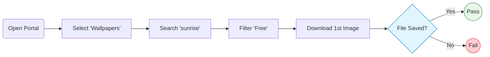

# Wallpaper Portal Automation Suite


A robust, high-performance automated regression suite designed for a digital content platform (Wallpapers & Ringtones). This framework focuses on critical user flows: **Search, Filtering, and Content Download**, with a strong emphasis on stability and resistance to "flakiness".

---

## Key features

### Stability Strategy
The suite employs advanced techniques to handle aggressive pop-ups, GDPR banners, and third-party scripts without slowing down the tests:
* **Network-Level Blocking:** Aborts requests matching `**/*didomi*` to reduce CMP/overlay injection. (Extendable if needed.)
* **DOM Injection & Cleaning:** A global fixture injects an init script that removes known overlay containers (e.g. `#didomi-host`) and unlocks scrolling; it runs on a short interval.
* **Best-effort banner suppression:** The goal is to avoid manual "Accept" clicks, but new third-party banners may still appear until their selectors/routes are added.

### Smart flakiness handling
Specifically tuned for UI animations and overlay interruptions:
* **Auto-Retry Assertions:** Wraps interaction steps in Playwright's `expect.toPass()` to automatically retry operations when the UI is unstable (e.g., menu opening delays).
* **Force Interactions:** Utilizes `{ force: true }` on critical click actions to bypass potential overlay interceptions (like stubborn banners) that might persist despite DOM cleaning.
* **Visibility Loops:** Explicitly verifies element visibility within the retry loop, ensuring interactions occur only when the UI is fully rendered.

### Modular architecture
* **Page Object Model (POM):** Strict separation of selectors and test logic.
* **Modular Configuration:** Browser profiles (`Chrome`, `Firefox`, `Safari`) are decoupled into `playwright.browsers.ts` for cleaner config management.
* **Auto-Fixtures:** Setup logic runs automatically via `{ auto: true }` fixtures, keeping test files clean and readable.

---

## Test workflow

The core regression scenario verifies the integration between category selection, search engine, filtering, and file download capabilities.



---

## Project structure

```text
📦 wallpaper-automation
 ┣ 📂 fixtures
 ┃ ┗ 📜 test-setup.ts         # Global setup: network blocking, DOM cleaning, auto-fixtures
 ┣ 📂 pages
 ┃ ┣ 📜 base.page.ts          # Shared logic
 ┃ ┣ 📜 ringtones...page.ts   # Search & category selection logic
 ┃ ┗ 📜 wallpapers.page.ts    # Filtering & download verification logic
 ┣ 📂 tests
 ┃ ┗ 📜 search.spec.ts        # Homework assignment example
 ┣ 📜 playwright.browsers.ts  # Isolated browser profiles
 ┣ 📜 playwright.config.ts    # Main configuration file
 ┗ 📜 package.json            # Scripts and dependencies
```

---

## Installation

1.  **Clone the repository:**
    ```bash
    git clone https://github.com/kobe3363/wallpapers.git
    cd <project-folder>
    ```

2.  **Install dependencies:**
    ```bash
    npm install
    ```

3.  **Install Playwright browsers:**
    ```bash
    npx playwright install
    ```

---

## Running tests

The project includes several `npm` scripts for different testing scenarios:

### Standard Execution
Run all tests:
```bash
npm run test:local
```

### UI Mode (Time Travel Debugging)
Opens Playwright's interactive UI runner:
```bash
npm run test:ui
```

### Browser-Specific Runs
Run tests only on a specific engine:
```bash
npm run test:chrome
```
```bash
npm run test:firefox
```

### Flakiness prevention
Repeats each test 10 times with a single worker to validate stability. Useful for verifying fixes for intermittent failures:
```bash
npm run test:local:flakiness
```
---
