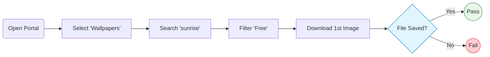

# 🎨 Wallpaper Portal Automation Suite


A robust, high-performance automated regression suite designed for a digital content platform (Wallpapers & Ringtones). This framework focuses on critical user flows: **Search, Filtering, and Content Download**, with a strong emphasis on stability and resistance to "flakiness".

---

## 🚀 Key Features

### 🛡️ "Bulletproof" Stability Strategy
The suite employs advanced techniques to handle aggressive pop-ups, GDPR banners, and third-party scripts without slowing down the tests:
* **Network-Level Blocking:** Automatically aborts requests to tracking/ad services (Didomi, Htlbid, Pubads) before they reach the browser.
* **DOM Injection & Cleaning:** A custom fixture injects a background script that proactively removes overlay elements (`#didomi-host`) from the DOM every 50ms.
* **Zero-Interaction Handling:** Tests do not waste time clicking "Reject Cookies" – the banners are prevented from rendering entirely.

### 🧠 Smart Flakiness Handling
Specifically tuned for UI animations and overlay interruptions:
* **Auto-Retry Assertions:** Wraps interaction steps in Playwright's `expect.toPass()` to automatically retry operations when the UI is unstable (e.g., menu opening delays).
* **Force Interactions:** Utilizes `{ force: true }` on critical click actions to bypass potential overlay interceptions (like stubborn banners) that might persist despite DOM cleaning.
* **Visibility Loops:** Explicitly verifies element visibility within the retry loop, ensuring interactions occur only when the UI is fully rendered.

### 🏗️ Modular Architecture
* **Page Object Model (POM):** Strict separation of selectors and test logic.
* **Modular Configuration:** Browser profiles (`Chrome`, `Firefox`, `Safari`) are decoupled into `playwright.browsers.ts` for cleaner config management.
* **Auto-Fixtures:** Setup logic runs automatically via `{ auto: true }` fixtures, keeping test files clean and readable.

---

## 🛠️ Installation

1.  **Clone the repository:**
    ```bash
    git clone https://github.com/kobe3363/wallpapers.git
    cd <project-folder>
    ```

2.  **Install dependencies:**
    ```bash
    npm install
    ```

3.  **Install Playwright browsers:**
    ```bash
    npx playwright install
    ```

---

## 🏃‍♂️ Running Tests

The project includes several `npm` scripts for different testing scenarios:

### Standard Execution
Run all tests in Headless mode (Default):
```bash
npm run test
```

### UI Mode (Time Travel Debugging)
Opens Playwright's interactive UI runner:
```bash
npm run test
```

### Browser-Specific Runs
Run tests only on a specific engine:
```bash
npm run test:chrome
```
```bash
npm run test:firefox
```

### Stress Testing (Flakiness Check)
Runs the tests 10 times in parallel (single worker) to prove stability. Useful for verifying fixes for intermittent failures:
```bash
npm test:local:flakiness
```
---

## 🧪 Test Workflow

The core regression scenario verifies the integration between category selection, search engine, filtering, and file download capabilities.



---

## Project Structure

```text
📦 wallpaper-automation
 ┣ 📂 fixtures
 ┃ ┗ 📜 test-setup.ts         # 🛡️ Global Setup: Network blocking, DOM cleaning, Auto-fixtures
 ┣ 📂 pages
 ┃ ┣ 📜 base.page.ts          # 🧩 Shared logic (Navigation, Cookies, Load states)
 ┃ ┣ 📜 ringtones...page.ts   # 🔍 Search & Category selection logic
 ┃ ┗ 📜 wallpapers.page.ts    # ⬇️ Filtering & Download verification logic
 ┣ 📂 tests
 ┃ ┗ 📜 search.spec.ts        # 🧪 Main E2E scenarios
 ┣ 📜 playwright.browsers.ts  # 🌐 Isolated browser profiles (Chrome, Firefox, Safari)
 ┣ 📜 playwright.config.ts    # ⚙️ Main configuration file
 ┗ 📜 package.json            # 📦 Scripts and dependencies
```

---

## 🧱 Data Driven Testing (JSON)
Tests are decoupled from data using JSON files located in `src/test/resources/data/`. We use a **Dynamic DataProvider** strategy.

**Convention:** The @Test method name must match the JSON key in the data file.

Example (`searchData.json`):
```json
{
    "testSearchAndCastNavigation": {
        "searchTerm": "QA",
        "minCastMembers": 3
    }
}
```

---

## ⚡ Framework Capabilities

### 🛡️ Resilience & Anti-Bot Strategy
IMDb employs strict anti-bot measures. This framework mitigates detection via:
* **Smart Headless:** Custom `ChromeOptions` and User-Agent rotation to mimic real user traffic in CI environments.
* **Dynamic Waits:** Leveraging Selenide's built-in smart waits (`shouldBe(visible)`) rather than hard sleeps.

### ⚡ Dynamic Parallelism
The suite automatically optimizes execution speed based on the host environment.
* **Logic:** `Threads = Max(1, Available Processors / 2)`.
* **Strategy:** `parallel = 'methods'`. Tests run concurrently at the method level.

### 🧠 AI-Driven Diagnostics
When a test fails, the custom `AIFailureListener` captures the stack trace and the HTML DOM snapshot into `build/ai_prompts/` folder.

**Workflow:**
1. Test Fails.
2. Developer opens `build/ai_prompts/PROMPT_testName_timestamp.txt`.
3. Developer pastes content into an LLM (ChatGPT/Claude) to receive an immediate fix suggestion based on the DOM state.

---

## 🛠️ Technology Stack

| Category | Technology | Version | Purpose |
| :--- | :--- | :--- | :--- |
| **Language** | Java | 17 (LTS) | Core development language (Assignment Requirement) |
| **Build Tool** | Gradle | 8.x | Dependency management and build lifecycle |
| **Automation** | Selenide | 7.5.1 | Fluent wrapper around Selenium WebDriver |
| **Orchestration** | TestNG | 7.10.2 | Test runner and parallel execution management |
| **Config** | Owner API | 1.0.12 | Type-safe property management |
| **Reporting** | Allure | 2.29.0 | Interactive execution history and failure analysis |
| **Linting** | Checkstyle | 10.12.0 | Enforcing Google Java Style standards |
